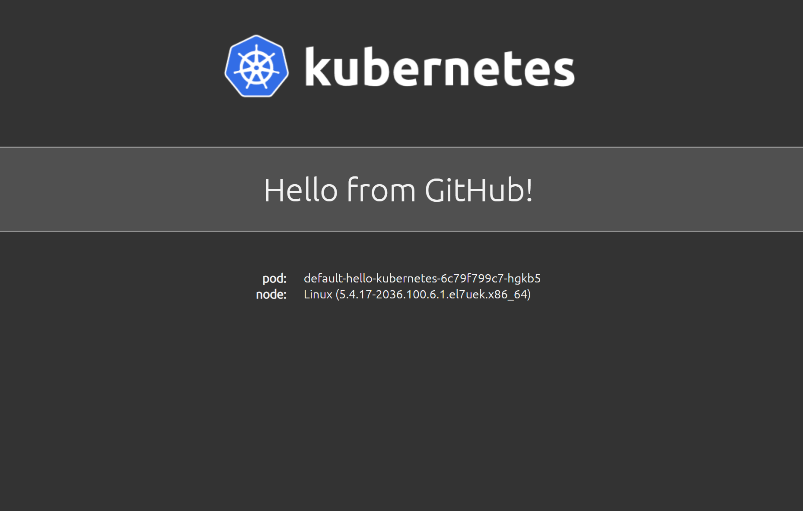

# Part 4 – Release Upgrade with New Values #

In this part we will learn how we are going to override default values, in order to modify our helm application release.
Let's start watching the pods, while we will perform operations in our Git repository.
 

1.	From the CloudShell enter the following command: 
```
watch kubectl get pod
```
In the output you should see an updating view of: 

```
       Every 2.0s: kubectl get pod                                                                                                    Tue Feb  2 15:30:04 2021

NAME                                        READY   STATUS    RESTARTS   AGE
default-hello-kubernetes-7b458f8c7b-4l285   1/1     Running   0          112m
default-hello-kubernetes-7b458f8c7b-587nl   1/1     Running   0          112m
default-hello-kubernetes-7b458f8c7b-j6cnh   1/1     Running   0          112m
```

2.	Go to your GitHub account and enter the new forked project.
Open oracle-gitops-workshop, then go to **clusters/default/flux-system**
Click on the following file: **hello-kubernetes.yaml**
Next click on the pencil and it will open the GitHub editor. 
 
Under the values section add new message, your result file should look like this:

``` 
apiVersion: helm.toolkit.fluxcd.io/v2beta1
kind: HelmRelease
metadata:
  name: hello-kubernetes
  namespace: flux-system
spec:
  interval: 1m
  timeout: 1m
  chart:
    spec:
      chart: ./charts/hello-kubernetes
      sourceRef:
        kind: GitRepository
        name: oracle-gitops-workshop
      interval: 1m
  targetNamespace: default
  values:
    message: Hello from GitHub!
```

•	Note if you are not sure and you are new to YAML and GitHub you can just copy the whole section from above and replace it with your file. 


 After you finished editing, it's time to commit the changes.
 In the bottom you will have a green button that says **Commit Changes**

Once you committed, go back to the watch screen in the Cloud Shell, and watch the magic happen.  


Let's check what exactly happened. 


3.	Stop the watch command by holding **CTRL + C** in the CloudShell.
Enter the following command, to get the reconciled git repository with latest commit:

```
kubectl get gitrepositories.source.toolkit.fluxcd.io -A
```

Output:
```
NAMESPACE     NAME                     URL                                                 READY   STATUS                                                              AGE
flux-system   oracle-gitops-workshop   https://github.com/deton57/oracle-gitops-workshop   True    Fetched revision: master/72477914c0eb179327a9c410b1917447f0b13705   126 
```

4.	Observe kustomize updated to the latest git commit:

```
kubectl get kustomizations.kustomize.toolkit.fluxcd.io -A
```

Output:
```
NAMESPACE     NAME                     READY   STATUS                                                              AGE
flux-system   oracle-gitops-workshop   True    Applied revision: master/72477914c0eb179327a9c410b1917447f0b13705   121m
```


5.	Observe helm release status:

```
kubectl describe helmreleases.helm.toolkit.fluxcd.io hello-kubernetes -n flux-system
```

Output at the bottom should display the event: 
```
Events:
  Type    Reason  Age                   From             Message
  ----    ------  ----                  ----             -------
  Normal  info    4m17s (x2 over 122m)  helm-controller  Helm upgrade succeeded
```

6.	You can also view the application from the web browser:

http://workerIP:30002




Excellent, you perfomed a release upgrade!

[Continue to Part 5 Pause/Resume Features](part5.md) 

If you want to return to the workshop homepage:

[Back to the general workshop section](README.md)
