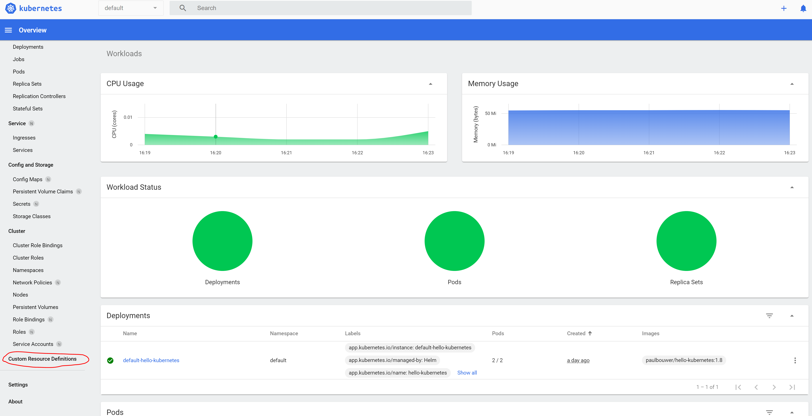
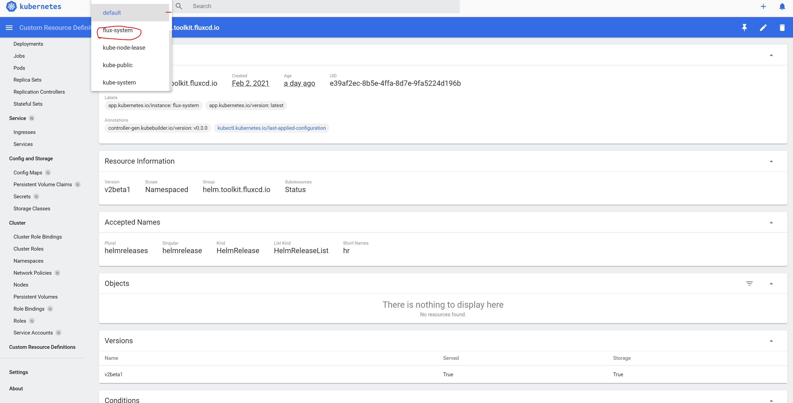
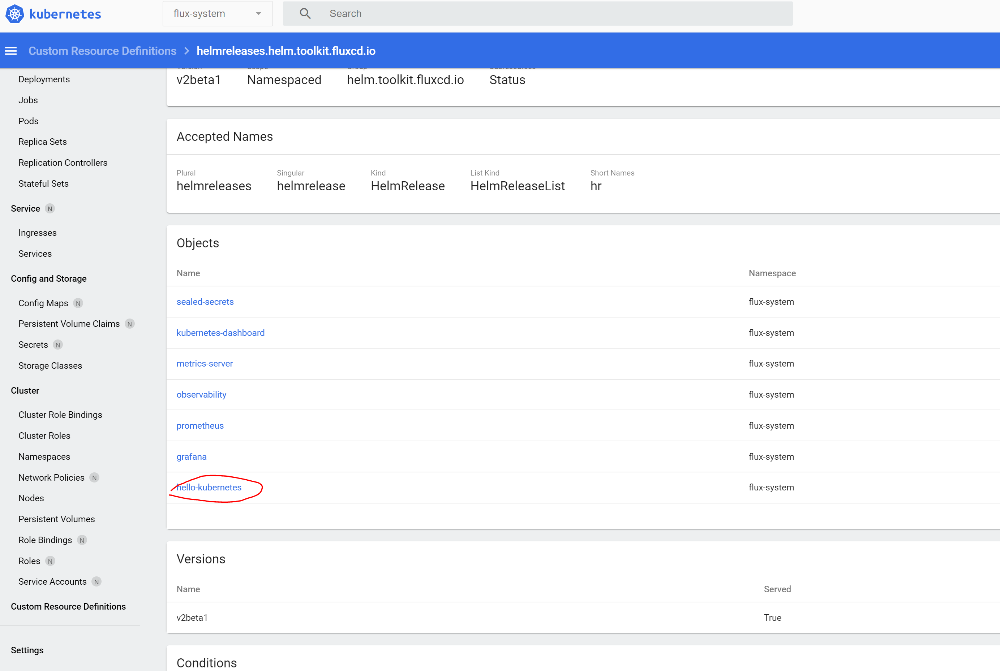
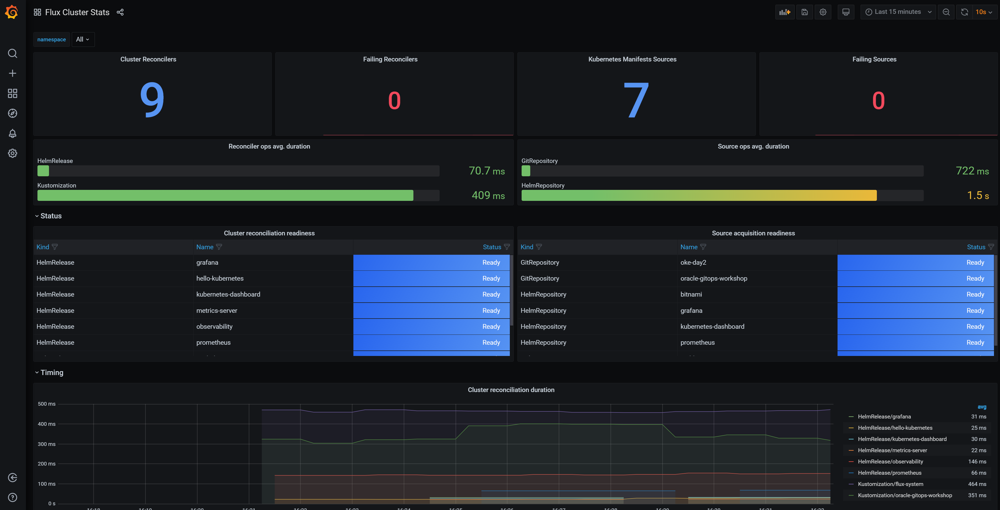

## Part 7 Provision OKE-Day2 Components ## 


This part will enhance your visibility and observability,
with some special add set of tools that will help you to manage your Kubernetes.


Add oke-day2 repository as a git source

1.	Run the following command from CloudShell: 
```  
./flux create source git oke-day2 \
--url=https://github.com/oqva-io/oke-day2 \
--branch=master \
--interval=30s
```

output: 
```
✚ generating GitRepository source
► applying GitRepository source
✔ GitRepository source created
◎ waiting for GitRepository source reconciliation
✔ GitRepository source reconciliation completed
✔ fetched revision: master/c0e55858f151e4dbee64e88c70cdcd40a54f18c2
```

2.	Now you can provision the oke-day2 components on your Kubernetes cluster, by running the following command: 
```
./flux create kustomization flux-system \
--source=oke-day2 \
--path="./clusters/default/flux-system" \
--prune=true \
--interval=30s
```

output: 
✚ generating Kustomization
► applying Kustomization
✔ Kustomization created
◎ waiting for Kustomization reconciliation
✔ Kustomization flux-system is ready
✔ applied revision master/c0e55858f151e4dbee64e88c70cdcd40a54f18c2


3.	Let's verify that all the pods are in Running state:

```
watch kubectl get pod -A 
```

4.	Let's observe oke-day2 Helm charts are synced
```
kubectl get helmcharts.source.toolkit.fluxcd.io -A
```

output:
```

NAMESPACE     NAME                               CHART                        VERSION   SOURCE KIND      SOURCE NAME              READY   STATUS                                 AGE
flux-system   flux-system-grafana                grafana                      6.1.10    HelmRepository   grafana                  True    Fetched revision: 6.1.10               2m39s
flux-system   flux-system-hello-kubernetes       ./charts/hello-kubernetes    *         GitRepository    oracle-gitops-workshop   True    Fetched and packaged revision: 0.1.2   24h
flux-system   flux-system-kubernetes-dashboard   kubernetes-dashboard         *         HelmRepository   kubernetes-dashboard     True    Fetched revision: 4.0.0                2m39s
flux-system   flux-system-metrics-server         metrics-server               5.0.2     HelmRepository   bitnami                  True    Fetched revision: 5.0.2                2m39s
flux-system   flux-system-observability          ./charts/k8s-observability   *         GitRepository    oke-day2                 True    Fetched and packaged revision: 0.1.0   2m39s
flux-system   flux-system-prometheus             prometheus                   12.0.1    HelmRepository   prometheus               True    Fetched revision: 12.0.1               2m39s
flux-system   flux-system-sealed-secrets         sealed-secrets               1.10.x    HelmRepository   stable                   True    Fetched revision: 1.10.3               2m39s
```


5.	Next let's observe helm charts are installed:
```
kubectl get helmreleases.helm.toolkit.fluxcd.io -A
```

output:
```
NAMESPACE     NAME                   READY   STATUS                             AGE
flux-system   grafana                True    Release reconciliation succeeded   4m5s
flux-system   hello-kubernetes       True    Release reconciliation succeeded   24h
flux-system   kubernetes-dashboard   True    Release reconciliation succeeded   4m4s
flux-system   metrics-server         True    Release reconciliation succeeded   4m4s
flux-system   observability          True    Release reconciliation succeeded   4m4s
flux-system   prometheus             True    Release reconciliation succeeded   4m4s
flux-system   sealed-secrets         True    Release reconciliation succeeded   4m4s 
```

Now that the tools are installed let's review them (Don't close the tabs you will need them for the next section):

1.	Open a browser window and enter to the installed Kubernetes Dashboard
Enter the following URL http://workerIp:30000



2.	Click on Custom Resource Definitions 


3.	Click on Helm Release 



4.	Choose the flux-system namespace from the top menu



5.	Click on the hello-kubernetes object


We need these tools for the next step, because in this step we are going to capture different events. 


6.	Let's open flux dashboard in Grafana

1.	Open another browser window 
Enter the following URL http://workerIp:30001


2.	Click on the 'Home" from the top menu
3.	Choose Flux Cluster Stats – from the dashboards

 

Here you will see the Flux dashboard with all the operations we are going to perform on the application. 

Excellent, now you have provisioned oke-day2 tools, and you have more eyes on your system. 

[Continue to Part 8 Breaking the Helm Release](part8.md) 

If you want to return to the workshop homepage:

[Back to the general workshop section](README.md)

